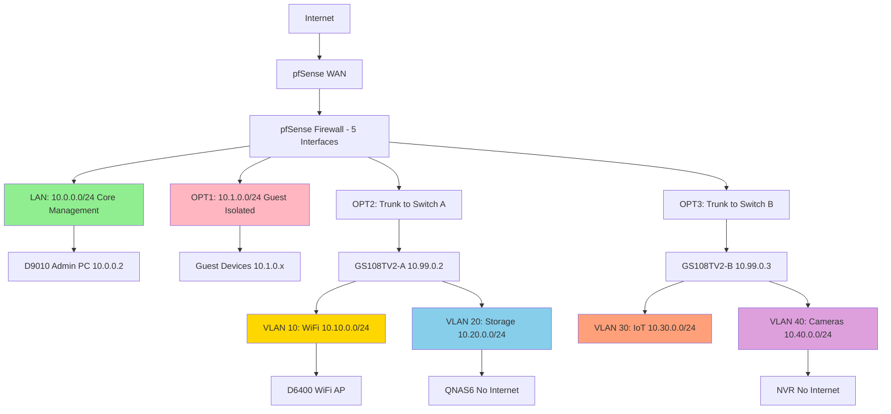

> **The Challenge:** When a neighbor's infected device compromised my entire network during COVID lockdown, I had a choice: patch it up or redesign it properly. I chose to rebuild using enterprise architecture principles. This is the story of that design process.

---

## 😱 **The Incident That Changed Everything**

**March 2020.** My neighbor **Elton** had just lost his job. He needed internet to apply for work. I gave him my WiFi password.

Three days later, my network was infected. His PC had malware that spread through my completely flat network topology—every device on the same subnet, no segmentation, no isolation. My NAS was compromised, laptop infected, smart devices acting strangely.

**That weekend, I made a decision:** Don't just fix it. **Redesign it properly.**

---

## 🎯 **The Design Philosophy**

Before writing a single firewall rule, I established a clear set of core design principles.

### 1. **Segmentation by Trust Level**
Not all devices deserve equal network access. A smart bulb shouldn't have the same privileges as my admin workstation.

### 2. **Defense in Depth**  
Multiple layers of security. If one control fails, others remain.

### 3. **Explicit Communication Policies**
Nothing talks to anything unless I explicitly allow it. Default deny everything.

### 4. **Intuitive Design**
The architecture should be self-documenting. IP addresses should immediately indicate the network a device belongs to and its associated trust level.

---

## 🏗️ **The Architecture Blueprint**

### Network Topology Diagram

_Complete network architecture showing pfSense firewall, VLANs, switches, and all network segments_

### **Phase 1: Trust-Based Segmentation**

I categorized every device by trust level and function:

**HIGH TRUST:**
- My **admin workstations** (responsible for managing and configuring the entire network infrastructure)
- **Network storage** (containing critical, irreplaceable data, with strict access controls)
- **Core network infrastructure** (including switches & access points that ensure reliable connectivity & security)

**MEDIUM TRUST:**
- **User devices** (phones, tablets, laptops)
- **Media servers** (that provide media streaming services with controlled access to network storage)

**LOW TRUST:**
- **IoT devices** (smart home gadgets & automation systems that often have weak security controls)
- **Security cameras** (and other surveillance devices which are common botnet targets)

**ZERO TRUST:**
- **Guest devices** (unknown risk profile)
- **Temporary access** (helping neighbors like Elton)

### **Phase 2: Professional IP Addressing Scheme**

I designed a systematic addressing plan that allows network function and intent to be identified at a glance.

| Network          | Subnet        | Purpose                    |
|------------------|---------------|----------------------------|
| Core Management  | 10.0.0.0/24   | Admin environment          |
| Guest Isolation  | 10.1.0.0/24   | Zero-trust zone            |
| WiFi/Family      | 10.10.0.0/24  | User devices               |
| Storage          | 10.20.0.0/24  | Protected data             |
| IoT/Smart Home   | 10.30.0.0/24  | Low-trust automation       |
| Security/Cameras | 10.40.0.0/24  | No internet access         |
| Management       | 10.99.0.0/24  | Network management devices |

**The logic:** The second octet immediately identifies function. `.10` = users, `.20` = storage, `.30` = IoT, `.40` = security, `.99` = management.

Within each subnet, consistent fourth octet allocation:

**Standard IP allocation within each /24 subnet:**

- `.1` = Gateway (pfSense interface)
- `.2 - .9` = Network equipment (switches, APs)
- `.10 - .49` = Servers and infrastructure
- `.50 - .99` = Static client assignments
- `.100 - .199` = DHCP pool for dynamic clients
- `.200 - .254` = Reserved for future expansion

**Why this matters:** When troubleshooting at 2 AM, I can instantly identify `10.30.0.45` as an IoT device with a static assignment, without consulting documentation.

---

## 🔐 **Security Architecture**

### **The Firewall: Traffic Control Center**

I implemented pfSense as the core policy enforcement point, ensuring every packet between network segments is evaluated against explicit security rules.

**My firewall strategy:**
- **Start with deny all** - Nothing communicates by default
- **Allow minimum necessary** - Explicitly define required communication
- **Log extensively** - Visibility into what's happening
- **Review regularly** - Rules get audited and optimised

### **Critical Design Decision: Strategic Internet Blocking**

Certain devices don’t require internet access, so blocking outbound connections became a key security control to prevent external threats.

**Example: The NAS Protection Strategy**

My network storage (QNAS6 at `10.20.0.10`) holds irreplaceable data—family photos, work documents, backups. The firewall blocks it from initiating any outbound internet connections.

**The reasoning:**
- The NAS can be accessed **FROM** my core network (`10.0.0.0/24`)
- WiFi devices can access it for media streaming
- But the NAS itself cannot call out to the internet

**Why this matters:** Ransomware requires communication with command-and-control servers to activate encryption. By blocking outbound internet from the NAS, even if it becomes infected, the ransomware cannot complete its attack sequence.

**Firewall rule:**
**NAS ransomware protection rule:**

- **Action:** Block
- **Source:** 10.20.0.10 (QNAP6)
- **Destination:** !RFC1918 (any address outside private networks)
- **Logging:** Enabled
- **Description:** "Ransomware protection - prevent NAS from initiating internet connections"

**Similarly, security cameras network rules (`10.40.0.0/24`):**

- No internet access (except manual firmware updates from admin network)
- Prevents IoT botnet recruitment
- Can only communicate with NVR and management network
- All outbound internet attempts logged and blocked

---

## 🛡️ **VLAN Implementation**

### **The Segmentation Strategy**

Each network segment was assigned its own VLAN (Virtual Local Area Network) to ensure proper isolation & security.

- **VLAN 1** (Native) → Core network management and administration, including key infrastructure devices
- **VLAN 10**           → User endpoints (incl. family Wi-Fi) with restricted resource access 
- **VLAN 20**           → Network Storage
- **VLAN 30**           → IoT devices with isolated external-only access and no internal connectivity
- **VLAN 40**           → Security and surveillance cameras isolated from the internet to prevent compromise
- **VLAN 99**           → Network Management

**Guest network (`10.1.0.0/24`)** runs on a dedicated physical interface without VLAN tagging—complete isolation at the physical layer.

### **Switch Configuration Architecture**

I deployed two Netgear GS108TV2 managed switches:

**Switch A Configuration(10.99.0.2):**

- **Management IP:** 10.99.0.2
- **VLANs distributed:** 10 (WiFi), 20 (Storage), 99 (Management)
- **Services:** Family WiFi, NAS storage, network management
- **Trunk port:** Port 1 to pfSense OPT2 (carries all VLANs)

**Switch B Configuration(10.99.0.3):**

- **Management IP:** 10.99.0.3
- **VLANs distributed:** 30 (IoT), 40 (Security), 99 (Management)
- **Services:** IoT devices, security cameras, network management
- **Trunk port:** Port 1 to pfSense OPT3 (carries all VLANs)

**Trunk port configuration details:**

- **Port 1:** Trunk mode
- **Tagged VLANs:** 10, 20, 99 (or 30, 40, 99 depending on switch)
- **Native VLAN:** 1
- **Destination:** pfSense OPT2 or OPT3
- **Ports 2-8:** Access mode, each assigned to specific VLAN with appropriate PVID

---

## 🔄 **Communication Flow Design**

### **The Trust Hierarchy**

I defined explicit privilege levels for each network segment to control access and ensure security.

**Trust Level 1 - Core Management (10.0.0.0/24)**
- Full access to all network segments
- Administration and configuration of all devices
- Centralized control over the entire network infrastructure

**Trust Level 2 - Storage & Management VLANs**
- Secure resources, including data storage and network management (10.20.0.0/24, 10.99.0.0/24)
- Access restricted to authorised networks only
- Internet access is either controlled or fully blocked

**Trust Level 3 - WiFi/Family (10.10.0.0/24)**
- Internet access with specific, limited services
- Restricted access to media and NAS for family devices
- No management access to network infrastructure

**Trust Level 4 - IoT & Cameras (10.30.0.0/24, 10.40.0.0/24)**
- Strictly isolated to minimize risk
- **IoT devices:** Internet access only, no access to internal networks
- **Cameras:** No internet access, limited to internal network for recording

**Trust Level 5 - Guest Isolation (10.1.0.0/24)**
- Internet access ONLY with no access to internal networks
- Full isolation from all internal network resources
- **Zero trust zone** ensuring maximum security for external devices

### **Example Communication Flow:
## 🛡️ **VLAN Implementation**

### **The Segmentation Strategy**

Each network segment got its own **VLAN** (Virtual Local Area Network):

- **VLAN 1** (Native) → Core Management
- **VLAN 10** → WiFi/Family  
- **VLAN 20** → Storage
- **VLAN 30** → IoT
- **VLAN 40** → Security/Cameras
- **VLAN 99** → Network Management

**Guest network** (`10.1.0.0/24`) runs on a **dedicated physical interface** without VLAN tagging—complete isolation at the physical layer.

### **Switch Configuration Architecture**

I deployed **two Netgear GS108TV2 managed switches**:

#### **Switch A Configuration (10.99.0.2):**

- **Management IP:** 10.99.0.2
- **VLANs distributed:** 10 (WiFi), 20 (Storage), 99 (Management)
- **Services:** Family WiFi, NAS storage, network management
- **Trunk port:** Port 1 to pfSense OPT2 (carries all VLANs)

#### **Switch B Configuration (10.99.0.3):**

- **Management IP:** 10.99.0.3
- **VLANs distributed:** 30 (IoT), 40 (Security), 99 (Management)
- **Services:** IoT devices, security cameras, network management
- **Trunk port:** Port 1 to pfSense OPT3 (carries all VLANs)

**Trunk port configuration details:**

- **Port 1:** Trunk mode
- **Tagged VLANs:** 10, 20, 99 (or 30, 40, 99 depending on switch)
- **Native VLAN:** 1
- **Destination:** pfSense OPT2 or OPT3
- **Ports 2-8:** Access mode, each assigned to specific VLAN with appropriate PVID

---

## 🔄 **Communication Flow Design**

### **The Trust Hierarchy**

I established clear privilege levels:

#### **Trust Level 1 - Core Management (10.0.0.0/24)**
- Full access to all networks
- Can manage all devices
- Complete administrative control

#### **Trust Level 2 - Storage & Management VLANs**
- Protected resources (10.20.0.0/24, 10.99.0.0/24)
- Controlled access from authorized networks
- Limited internet access or blocked

#### **Trust Level 3 - WiFi/Family (10.10.0.0/24)**
- Internet access + specific services
- Can access media and NAS (limited)
- Cannot manage network equipment

#### **Trust Level 4 - IoT & Cameras (10.30.0.0/24, 10.40.0.0/24)**
- Heavily restricted
- IoT: Internet only, isolated from other networks
- Cameras: No internet, internal recording only

#### **Trust Level 5 - Guest Isolation (10.1.0.0/24)**
- Internet access ONLY
- Completely blocked from all internal networks
- Zero trust zone

### **Example Communication Flow: Media Streaming**

#### **Example 1: iPad accessing Plex media server**

- **Source:** iPad (10.10.0.50)
- **Destination:** Media Center (10.10.0.10)
- **Port:** 32400 (Plex)

**Firewall evaluation:**
  ✅ Source network: WiFi VLAN 10  
  ✅ Destination: Same VLAN (intra-VLAN communication)  
  ✅ Port: 32400 (explicitly allowed for media streaming)  

**Result:** ALLOW  
**Action:** Permit connection and log for traffic analysis

#### **Example 2: iPad trying to access network management**

- **Source:** iPad (10.10.0.50)
- **Destination:** Switch A (10.99.0.2)
- **Port:** 443 (HTTPS management interface)

**Firewall evaluation:**
  ✅ Source network: WiFi VLAN 10  
  ❌ Destination: Management VLAN 99  
  ❌ Policy: WiFi devices NOT permitted to manage equipment  

**Result:** BLOCK  
**Action:** Drop connection and log security event

---

## 🧩 **The Guest Isolation Solution**

### **Designing for Safe Neighbor Access**

After the **Elton incident**, I needed a way to help people without risk. The **guest network** (`10.1.0.0/24`) became that solution.

#### **Architecture:**
- Dedicated physical interface (OPT1) on pfSense
- No VLAN tagging (additional isolation)
- Completely separate from all other networks

#### **Firewall policy:**
**Firewall rules for guest network:**

- ❌ **Block:** Guest → pfSense management (port 443/80)
- ❌ **Block:** Guest → Core network (10.0.0.0/24)
- ❌ **Block:** Guest → ALL RFC1918 addresses (all private IPs)
- ✅ **Allow:** Guest → Internet only (non-RFC1918 destinations)

**The result:** When Elton (or any guest) connects to `10.1.0.150`, they get:
- ✅ Full internet access for job searching, browsing
- ❌ Zero visibility into my internal networks
- ❌ Cannot access NAS, switches, pfSense, or any device

The firewall logs confirm isolation is working:

- **BLOCK:** 10.1.0.150 → 10.0.0.1 (Guest trying to reach pfSense)
- **BLOCK:** 10.1.0.150 → 10.20.0.10 (Guest trying to reach NAS)
- **BLOCK:** 10.1.0.150 → 10.99.0.2 (Guest trying to reach switch)

## 🖥️ **Hardware Architecture**

## 💡 **Key Design Decisions & Rationale**

### 🛠 **1. Why Separate Management VLAN (99)?**
- **Decision:** Network equipment management interfaces on a dedicated VLAN.
- **Rationale:** Prevents user devices from discovering or accessing switch/AP configs. Only `10.0.0.0/24` can manage.

### 🔒 **2. Why Block NAS from Internet?**
- **Decision:** NAS cannot initiate outbound internet connections.
- **Rationale:** Blocks ransomware command channels while still allowing internal access.

### 📡 **3. Why Isolate IoT on Separate VLAN?**
- **Decision:** IoT devices live in VLAN30, restricted to internet only.
- **Rationale:** Low-trust devices with poor security should never reach internal systems.

### 🧱 **4. Why Guest Network on a Physical Interface?**
- **Decision:** Guest WiFi on dedicated interface (no VLAN tagging).
- **Rationale:** Physical separation adds defense in depth — less risk from VLAN attacks.

### 📊 **5. Why Consistent IP Scheme Across Subnets?**
- **Decision:** Uniform `.1 = gateway`, `.10–.49 = servers`, etc.
- **Rationale:** Makes identification and troubleshooting intuitive at a glance.

---

## 📈 **The Resulting Architecture**

### 🌀 **Network Characteristics**
- **Segmentation:** 7 distinct security zones
- **Control:** 80+ explicit firewall policies
- **Security Model:** Default deny + explicitly allow
- **Scalability:** Clean /24 blocks + room for growth
- **Monitoring:** All inter-zone logs retained and reviewed

### 🖼 **Visual Architecture Summary**

**Network Flow Overview:**

**Internet → pfSense Firewall (Central Control) → Network Segments:**

- **Core Management (10.0.0.0/24):** Full admin access  
- **Guest Isolation (10.1.0.0/24):** Internet only  
- **WiFi/Family (10.10.0.0/24):** User devices, controlled access  
- **Storage (10.20.0.0/24):** NAS — no internet init  
- **IoT (10.30.0.0/24):** Smart devices — isolated  
- **Cameras (10.40.0.0/24):** No internet — internal display only  
- **Management (10.99.0.0/24):** Switches & APs — admin only

All inter-network traffic controlled by explicit firewall rules.

---

## 🎯 **Architecture Highlights**

### **What This Design Demonstrates**
✅ **Security-First Thinking**  
✔ Multiple defense layers  
✔ Default deny extended to every segment

✅ **Enterprise Principles at Any Scale**  
✔ VLANs, trust tiers, centralized policy point  
✔ Professional IP design

✅ **Systematic & Documented**  
✔ Decision rationale captured in rules  
✔ Logs validated via test cases

✅ **Real-World Application**  
✔ Family network secure  
✔ Usability preserved  
✔ Safe neighbor support without risk

---

## 🔧 **Implementation Details**

### **VLAN Trunk Configuration**

**Switch A trunk port configuration:**
- **Interface:** Port 1
- **Mode:** Trunk
- **Tagged VLANs:** 10, 20, 99
- **Native VLAN:** 1
- **Speed:** 1000 Mbps
- **Destination:** pfSense OPT2

**Access port example (WiFi AP):**
- **Interface:** Port 2
- **Mode:** Access
- **VLAN:** 10 (WiFi)
- **PVID:** 10
- **Untagged:** VLAN 10
- **Connected Device:** D6400 Access Point

### **Firewall Rule Structure**

Rules evaluated top-to-bottom (first match wins):

**WiFi VLAN (VLAN10) rules:**
1. Allow → Plex media server  
2. Allow → NAS file access  
3. Allow → Internet  
4. Block → Core management  
5. Block → Management VLAN  
6. Block → pfSense web UI  
7. Log all traffic  
8. Default deny (catch-all)

---

## 📊 **Before & After Comparison**

### 🧠 **Before the Redesign**
- **Topology:** Flat network  
- **Subnets:** 1  
- **Segmentation:** None  
- **Firewall rules:** ~5 basics  
- **Incident Result:** One device compromised everything  

### 🚀 **After the Redesign**
- **Topology:** Segmented, hierarchical  
- **Subnets:** 7 security zones  
- **Firewall rules:** 80+ explicit policies  
- **Guest access:** Isolated  
- **IoT devices:** Internet only  
- **NAS:** No internet initiation  
- **Monitoring:** Full logs  
- **Incident Result:** Infections contained at zone level

---

## 🎓 **The Architecture Mindset**

### **How I Approached the Design**
1. **Start with trust boundaries**  
2. **Build defense in depth**  
3. **Make it intuitive**  
4. **Plan for growth**  
5. **Test every boundary**

Good architecture isn’t accidental — it’s engineered.

---

## 💭 **Reflection: Lessons from the Redesign**

### **What I Learned**
- 🔄 **Security incidents become catalysts**
- 🏢 **Enterprise principles work everywhere**
- 📐 **Intuitive design matters**
- 📘 **Documentation saves future you**
- ✔ **Security doesn’t sacrifice usability**

---

## 📝 **The Design Process Summary**

Every great architecture starts with:
1. **Requirements**
2. **Trust grouping**
3. **Segmentation**
4. **Explicit policies**
5. **Implementation**
6. **Validation**
7. **Monitoring**

The result: A network that’s not just connected — it’s **architected.**

---

## 🙏 **Epilogue: The Neighbor**

Elton eventually got back on his feet and moved into his own place. When he visits, he connects to the WiFi VLAN like everyone else — safe, segmented, monitored.

If he ever needs help again, `10.1.0.150` is waiting. The architecture enables me to be a good neighbor **without being a security risk.**

**Network designed:** February 2024  
**Approach:** Trust-based segmentation with defense in depth  
**Status:** Production — Zero security incidents since deployment

